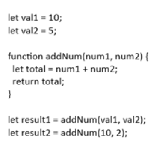
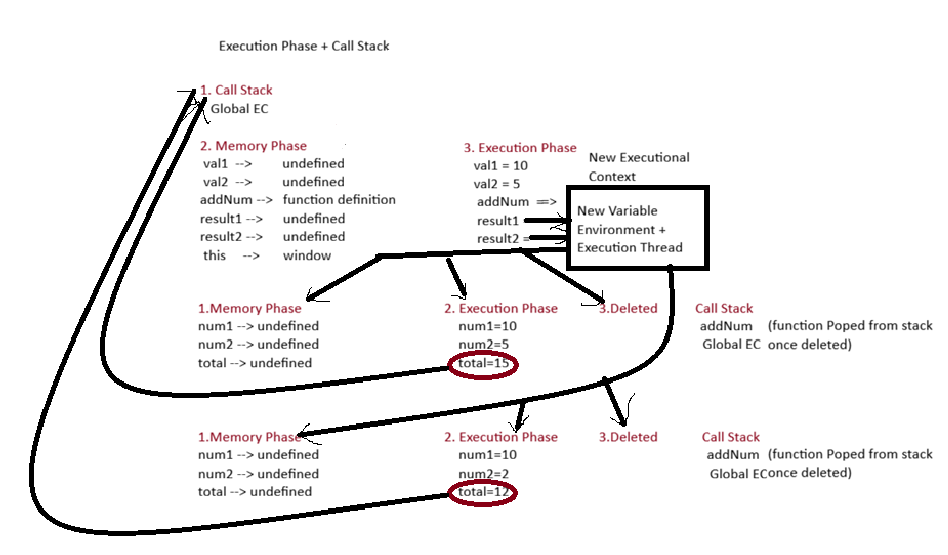

what is browser Global context (in console)? Windows object
what is node js environment Global context (in editor..vScode)? empty object
Javascript is a single threaded, every task is a thread

JavaScript Execution Context (JEC)
----------------------------------------------
Execution Context = 

JS can’t execute code “in the air”.

It needs a place where it knows:

What variables exist?
What functions exist?
What is "this"?
What code line is currently running?
Where to return after a function finishes?
👉 That place is called an Execution Context.

Types of Execution Contexts:
-------------------------------------------------------------------------
1.Global Execution Context (GEC)
----------------------------------- 
Purpose of GEC: 
To run global code and act as the base environment.Every JS file must start somewhere.That “somewhere” is the Global Execution Context.

What GEC provides:

A place for global variables
A place for global functions
A value for this
Entry point of the program

💡 Without GEC, JS wouldn’t know:
where execution starts
what this means globally
That’s why GEC is mandatory.

The global object (window) becomes the environment for your JS file.

2.Function Execution Context (FEC)
-------------------------------------- 
Purpose of FEC:

To isolate function execution.

Why do we need it?

Because functions should:
Have their own variables
Not mess with global variables
Run independently

3.Val Execution Context (rare / mostly ignorable)
-----------------------
Purpose?
To execute code passed via eval()

Practically:
🚫 Avoid it.
⚠️ Security + performance nightmare.

-----------------------------------------------------------------------------------

Phases of Execution Context     + Call Stack
-----------------------------------------------------
i) GEC
ii) Memory creation phase
iii) Execution phase 

Example:

